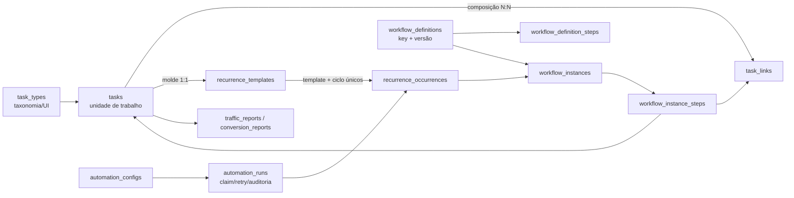

# Auditoria do backend de tarefas e automações

Data: 2026-09-16. Escopo: schema Supabase de produção, backend de tarefas, recorrência, workflows e automações de relatório.

## Resultado executivo

O núcleo `tasks + task_links` é suficiente e deve ser preservado. O problema não é falta de mais uma tabela de cards; é a mistura de quatro conceitos no mesmo conjunto de campos:

1. classificação do trabalho (`kind/subtype`);
2. composição (`task_links`);
3. recorrência (`plan_id` + chaves em `payload`);
4. execução de workflow/automação (`flow_parent`, `automation_flow` e outras chaves em `payload`).

Essa mistura já produziu um erro observável: o molde recorrente de relatório foi reclassificado como Entrega porque uma migration confundiu o tipo do output com o tipo do gatilho.

## Evidência do card investigado

No card informado pelo usuário, a leitura de produção encontrou:

| entidade | classificação/estado |
|---|---|
| molde | `kind=criativo`, `subtype=null`, semanal, `recurrence_group=true` |
| ocorrência seguinte | `kind=criativo`, `flow_parent=true`, `automation_flow=report_conversion` |
| automação 1 | `relatorio_trafego_semanal`, ativa, aponta para o molde |
| automação 2 | `relatorio_vendas`, ativa, depende da automação 1 e aponta para o mesmo molde |

O molde não possui etapas em `task_links`; a ocorrência é o contêiner que deve recebê-las. Logo, exibir o molde como Entrega não representa sua função real.

## Causa

`20260916190000_relatorio_entrega_northia.sql` mudou para `criativo` todo card alvo de qualquer uma das duas automações. Já `lib/automations/execute.ts` preserva a semântica correta: o molde é uma tarefa recorrente comum e `ensureFlowOccurrence()` transforma apenas a ocorrência em Entrega de relatório.

O banco aceitou o estado porque hoje não existe constraint entre:

- `automation_configs.automation_key`;
- forma exigida do `target_task_id`;
- `tasks.kind/recurrence_cadence/payload.recurrence_group` do alvo;
- `workflow` permitido para a ocorrência.

## Outros achados prioritários

### P0 — clone de Plano usa a relação removida

`lib/automations/provision.ts::clonePlan()` ainda lê e grava membros por `tasks.plan_id`. Desde `20260828210000_task_types_e_links.sql`, membros de Plano usam `task_links` com `slot is null`; `plan_id` ficou exclusivo para ocorrência recorrente. Um clone pode nascer vazio na UI ou criar uma relação semanticamente falsa.

Correção: ler os elos do plano, clonar as tarefas e inserir novos elos preservando `position`. Depois, migrar qualquer uso residual de `plan_id` cujo pai seja `plano_acao` e bloquear novas gravações desse formato.

### P0 — etapa manual pode colidir com o worker de relatório

A UI permite vincular manualmente um card a um slot planejado de relatório. O worker procura primeiro o ID determinístico, não o slot ocupado. Se houver um card manual no slot, a inserção do elo determinístico viola a unicidade `(parent_id, slot)` e a automação para.

Correção: slots de workflow automatizado não são editáveis manualmente. O backend também deve resolver por instância/slot e emitir conflito explícito se encontrar um card diferente do esperado.

### P0 — falha é registrada como execução do dia

`runAutomations()` atualiza `last_run_date` mesmo depois de erro. A guarda diária então impede retry, inclusive manual. A comparação `due_date === today` também não recupera um cron perdido.

Correção: `automation_runs` idempotente por `(config_id, scheduled_for)`, com `running/succeeded/failed`, tentativas e erro. Somente sucesso avança o cursor; cron usa `due_date <= today` dentro de uma janela controlada.

### P1 — estado estrutural excessivo em JSONB

`recurrence_parent_id`, ciclo, data da ocorrência, workflow e progresso estrutural estão no `payload`. Alguns são consultados em lote sem integridade referencial. O índice temporal de `task_metrics (client_id, period_to desc)` já existe; falta normalizar a identidade de ocorrência/workflow e indexar a leitura transitória enquanto o dual-write existir.

### P1 — responsável tem três fontes

Há `tasks.assignee` textual, `task_assignees` N:N e `task_types.default_assignee` textual. O caminho administrativo ainda cria `TaskRecord` não hidratado com `assignee_profile_ids=[]`, o que torna “sem responsável” indistinguível de “responsáveis não carregados”.

Correção: `task_assignees` é a relação canônica; `tasks.assignee` é somente snapshot/display. DTOs devem distinguir `TaskRow` de `HydratedTask`, sem preencher ausência de join com lista vazia. Defaults novos devem apontar para uma política/papel, não para nome livre.

## Arquitetura alvo enxuta



Princípios:

- `task_types` responde somente “que trabalho é este?”;
- `recurrence_templates/occurrences` respondem “de qual agenda/ciclo veio?”;
- `workflow_definitions/instances` respondem “qual processo versionado esta ocorrência executa?”;
- `automation_runs` responde “o scheduler tentou, conseguiu e pode repetir?”;
- `tasks` continua sendo o único card; as novas tabelas descrevem relações e execução, não duplicam trabalho.

Para o relatório:

```text
automation_config
  -> automation_run(scheduled_for)
  -> recurrence_occurrence(template, cycle)
  -> workflow_instance(report_conversion, version)
  -> trafego -> feedback -> conversao
  -> artefatos/revisões -> conclusão
```

## Diferença de schema proposta

| atual | alvo |
|---|---|
| molde e ocorrência identificados por `plan_id` + JSONB redundante | FK/unique explícitas em `recurrence_occurrences` |
| fluxo de relatório hardcoded em `REPORT_FLOW_STEPS` | definição versionada e instância congelada |
| `last_run_date` mistura tentativa e sucesso | `automation_runs` com estado e retry |
| slot diz plano ou etapa apenas por ser null/não-null | instância de workflow valida os slots automatizados |
| responsáveis “não carregados” viram `[]` | DTO distingue relação não hidratada de lista vazia |
| alvo de automação aceita qualquer shape | validação por chave/política antes de salvar e executar |

## Sequência de migrations

1. Preflight e backfill do uso indevido de `plan_id` em Planos; corrigir `clonePlan()`.
2. Migration corretiva dos moldes de relatório: `criativo -> operacional`, sem tocar nas ocorrências `flow_parent`.
3. Índice parcial transitório para `(payload->>'recurrence_parent_id', due_date, id)` em tarefas abertas, se o `EXPLAIN` confirmar uso.
4. Criar `automation_runs` e trocar retry/catch-up para esse ledger.
5. Criar tabelas de recorrência; dual-write, backfill, constraints e depois dual-read.
6. Criar definições/instâncias versionadas de workflow; migrar `REPORT_FLOW_STEPS` para dados sem alterar instâncias antigas.
7. Tornar slots automatizados imutáveis pela UI/API e validar vínculo task/slot/instância.
8. Retirar leituras estruturais do JSONB somente após equivalência medida em produção.

Cada etapa deve ter SQL de preflight, ser idempotente, registrar contagens antes/depois e possuir rollback explícito. Como produção é o único ambiente integrado, nenhuma migration deve combinar backfill destrutivo e remoção de compatibilidade na mesma transação de rollout.

## Invariantes novas

- alvo de `relatorio_trafego_semanal` é uma tarefa recorrente simples, não uma Entrega;
- somente a ocorrência com workflow `report_conversion` é pai das três etapas;
- uma ocorrência é única por `(template, cycle)`;
- uma etapa é única por `(workflow_instance, step_key)`;
- membro de Plano nunca usa `tasks.plan_id`;
- falha de automação não conta como sucesso nem impede retry;
- “responsáveis não carregados” nunca é serializado como “sem responsáveis”.

## Estado desta auditoria

Leitura e documentação concluídas. Nenhuma correção de dados ou DDL desta arquitetura foi aplicada nesta etapa: o card investigado está em produção e o backfill correto deve entrar em uma nova migration, com proteção para não reclassificar ocorrências já materializadas.
