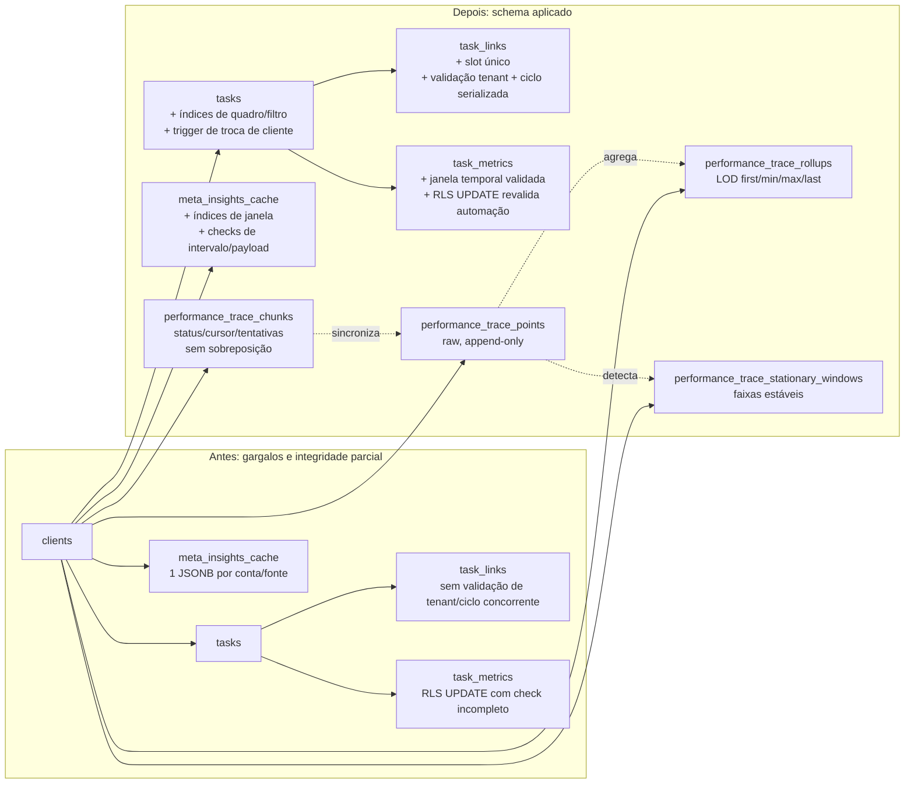

# Diferença de schema aplicada em produção — 2026-09-16

As migrations `20260916232701` e `20260916232706` foram aplicadas diretamente
ao Supabase de produção e registradas no ledger. Não houve DML persistente de
validação. O vínculo legado cross-client em `task_links` foi preservado para
decisão operacional posterior; as novas regras impedem novas violações.

## Mudanças materiais

| Área | Antes | Aplicado |
| --- | --- | --- |
| CRUD de tasks | leituras de quadro sem os índices compostos dedicados | índices para quadro, não atribuídas, tipo, fluxo e relações |
| Grafo de tasks | podia aceitar ciclo concorrente, slot duplicado e alteração posterior de tenant | lock transacional do grafo, índice único por slot e triggers de integridade |
| Métricas/cache | checks temporais ausentes; cache JSONB sem índice de janela | constraints `NOT VALID` para novas escritas e índice por cliente/fonte/janela |
| Trace amplo/zoom | não havia armazenamento temporal normalizado | raw points, envelopes LOD, janelas paradas e chunks de ingestão com RLS |

`meta_insights_cache` continua compatível com o runtime atual e ainda mantém a
unicidade por `(account_id, datasource)`. As novas consultas por janelas devem
migrar para `performance_trace_*`; alterar a chave do cache legado exigirá o
cutover do consumidor, não apenas um índice.
